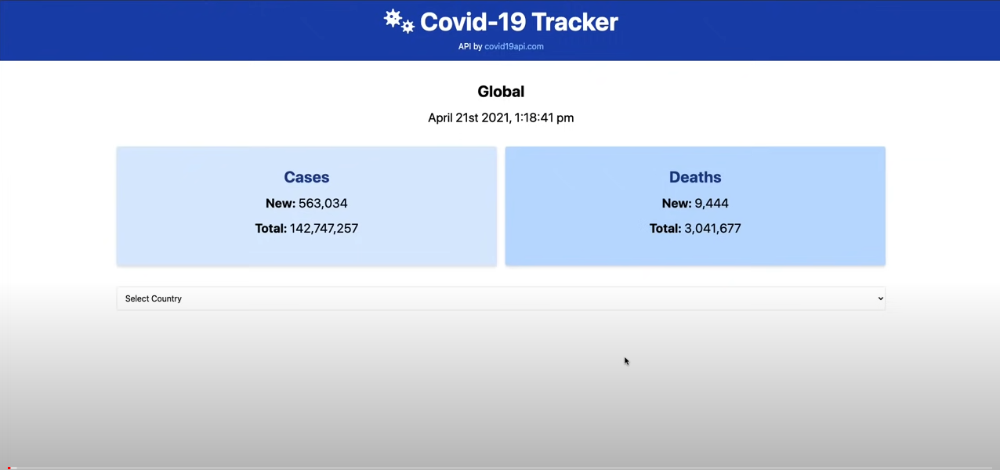

# COVID TRACKER DASHBOARD

Displays the new/total cases and deaths globaly as well as per country

## Authors

- [@Anita-Liberatore](https://github.com/Anita-Liberatore)





## Deployment

To deploy this project:

```bash
  npm i (to install node modules)
  npm run serve
```


## API Reference

This project uses the covid19api.com by Kyle Redelinghuys.

The service providing the covid 19 API was discontinued in May. Therefore, all data cannot be displayed due to the lack of connection to the API.

There are fake data api with mock data.
- [@API-covid](https://covid19api.com/) (discontinued in may - does not work)

- Web site deployed with Netlify
  [@CovidTrackerVueFe](https://master--celadon-kelpie-56785d.netlify.app/)


## 🚀 About Me
I'm a full stack developer / Java Developer at ATS S.p.A in Turin...


## 🔗 Links
[](https://www.linkedin.com/in/anitaliberatore/)


## Other Common Github Profile Sections
👩‍💻 I'm currently working at ATS SPA

🧠 I'm currently learning Vue.js / Angular / Node.js / Flutter / Spring Boot and React.js

