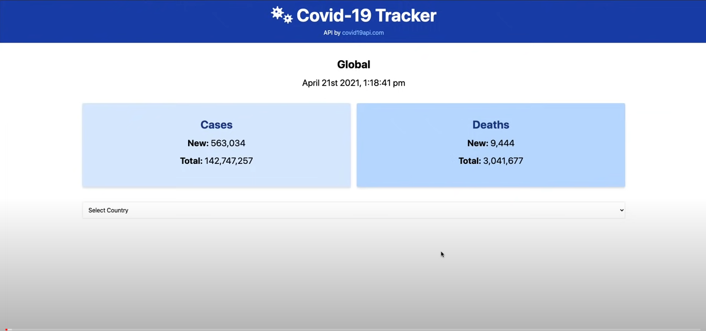

# COVID TRACKER DASHBOARD

Displays the new/total cases and deaths globally as well as per country.

## Authors

- [@Anita-Liberatore](https://github.com/Anita-Liberatore)



## Deployment

To deploy this project, follow these steps:

1. Install the necessary node modules:
    ```bash
    npm install
    ```

2. Start the development server:
    ```bash
    npm run serve
    ```

## API Reference

This project originally used the covid19api.com by Kyle Redelinghuys. However, the service providing the COVID-19 API was discontinued in May. Therefore, all data cannot be displayed due to the lack of connection to the API.

There are fake data APIs with mock data:
- [API-covid](https://covid19api.com/) (discontinued in May - does not work)

Please note that the COVID-19 APIs might not work, and there are references to mock data within the code.

The website is deployed with Netlify:
- [CovidTrackerVueFe](https://master--celadon-kelpie-56785d.netlify.app/)

## 🚀 About Me

I'm a full stack developer / Java Developer.

## 🔗 Links

[](https://www.linkedin.com/in/anitaliberatore/)

## Other Common Github Profile Sections

👩‍💻 I'm currently working at HYPE (fintech).

🧠 I'm currently learning Vue.js, Angular, Node.js, Flutter, Spring Boot, and React.js.